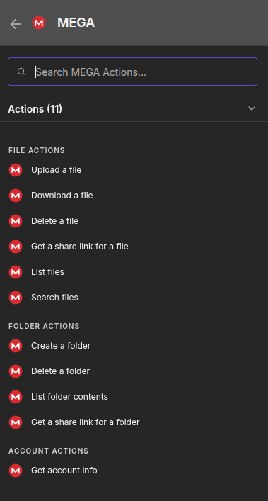

# n8n-nodes-mega-multi



An n8n community node for [MEGA](https://mega.nz) cloud storage. It uploads, downloads, and manages files and folders, and it is built so that a single workflow can work across many MEGA accounts.

The node uses the [megajs](https://mega.js.org) library, which talks to MEGA's API directly and performs the client side encryption in process. It does not shell out to `megacmd`, so there is no shared login session on disk and no per user state to manage. Every execution authenticates on its own, which is what makes multiple accounts practical.

## Requirements

* n8n 1.x or 2.x, self hosted
* Node.js 18.17 or newer
* A MEGA account. The consumer account is fine; MEGA S4 is not required.

## Installation

n8n loads any `*.node.js` and `*.credentials.js` file it finds under `~/.n8n/custom`, where `~` is the home directory of the user the n8n process runs as.

```bash
git clone https://github.com/rabbitmcs/mega-hosting-n8n-node.git
mkdir -p ~/.n8n/custom
cp -r mega-hosting-n8n-node/dist mega-hosting-n8n-node/package.json mega-hosting-n8n-node/index.js ~/.n8n/custom/
cd ~/.n8n/custom
npm install --omit=dev
```

Restart n8n, then hard refresh the editor in your browser. The node appears as "MEGA".

If n8n runs as a dedicated system user with a `nologin` shell, run the install steps as that user, for example:

```bash
sudo -u n8n env HOME=/home/n8n npm install --omit=dev --prefix /home/n8n/.n8n/custom
sudo chown -R n8n:n8n /home/n8n/.n8n/custom
sudo systemctl restart n8n
```

A custom extensions directory outside the default location can be set with the `N8N_CUSTOM_EXTENSIONS` environment variable.

## Credentials

The credential type is "MEGA Account" with three fields.

| Field | Required | Notes |
| --- | --- | --- |
| Email | Yes | The account email address |
| Password | Yes | The account password |
| Two-Factor Secret | No | The base32 TOTP secret, not a six digit code |

If the account has two factor authentication enabled, paste the base32 secret shown when 2FA was set up, for example `JBSWY3DPEHPK3PXP`. The node derives a fresh six digit code at execution time, so scheduled workflows keep working. A stored six digit code would expire after thirty seconds and is not accepted.

Credentials are stored by n8n using its own encryption. Nothing is written to disk by this node.

## Working with multiple accounts

The Authentication parameter selects where the login comes from.

**Stored Credential** uses a MEGA Account credential configured in n8n. Use this when a workflow always targets the same account.

**From Input Data** reads Email, Password, and Two-Factor Secret from node parameters, which accept expressions. Use this to drive the account from the incoming item, so one node can iterate over an arbitrary number of accounts.

```
Email:    {{ $json.email }}
Password: {{ $json.password }}
```

A common pattern is to keep the account list in a database or a Google Sheet, read it with the appropriate node, and pass each row into the MEGA node. Note that credentials handled this way live in the workflow data and appear in execution logs, so prefer stored credentials where the account set is small and stable.

Within a single execution the node logs in once per distinct email address and reuses that session for every item belonging to it, then closes all sessions when the execution finishes. Processing two hundred files across three accounts performs three logins, not two hundred.

## Reading folders shared with you

A MEGA share link carries its own decryption key in the fragment after the `#`. In principle that key is all that is needed, but MEGA often blocks anonymous requests from server and datacenter IPs with `EBLOCKED (-16)`. The Shared Link resource therefore logs in with a credential by default and opens the link using that session. Set Authentication to **None (Shared Link Only)** to open links anonymously.

All the usual link styles are accepted:

```
https://mega.nz/folder/AbCdEfGh#TheDecryptionKey
https://mega.nz/file/XyZw1234#TheDecryptionKey
https://mega.nz/#F!AbCdEfGh!TheDecryptionKey
```

Opening a folder link fetches the entire node tree in a single request and decrypts the filenames locally, so List returns everything including nested subfolders without one request per folder.

Bandwidth on a share link is charged to the account that owns it, not to you. If that owner runs out, operations fail with a quota error you cannot resolve from your side. The node reports that case with a specific message rather than a generic failure.

## Operations

### File

| Operation | Description |
| --- | --- |
| Upload | Uploads a binary field to a folder path. Missing folders are created by default. Can return a public link in the same step. |
| Download | Downloads a file by path and returns it as binary data. |
| Delete | Moves a file to the rubbish bin, or erases it permanently. |
| Get Share Link | Creates a public MEGA link, optionally without the decryption key. |
| List | Lists the files in a folder, optionally descending into subfolders. |
| Search | Finds files anywhere in the account whose name contains a given string, case insensitive. |

### Folder

| Operation | Description |
| --- | --- |
| Create | Creates a folder and any missing parent folders. |
| Delete | Moves a folder to the rubbish bin, or erases it permanently. |
| List | Lists the contents of a folder, files and subfolders. |
| Get Share Link | Creates a public folder link. |

### Shared Link

Uses a credential by default (any MEGA account works, it does not need access to the folder). Can be set to None to open links anonymously.

| Operation | Description |
| --- | --- |
| List | Lists the files in a shared folder link. Recursive by default, with an optional name filter. |
| Download All | Downloads every file in a shared folder, one output item per file, each carrying its own binary. |
| Download | Downloads a single shared file. For a folder link, set Path Inside Folder to select one file. |

### Account

| Operation | Description |
| --- | --- |
| Get Info | Returns storage used, storage total, percentage used, and bandwidth figures. Useful as a credential test and for routing uploads to whichever account has space. |

## Path conventions

Paths are slash separated and resolved from the root of the Cloud Drive.

* `/` is the Cloud Drive root
* `/invoices/2026` is a folder
* `/invoices/2026/january.pdf` is a file

A leading `/Root` or `/Cloud Drive` segment is accepted and ignored, so paths copied out of the MEGA web interface work as written.

## Output

File and folder operations return the following fields.

```json
{
  "nodeId": "A1b2C3d4",
  "name": "january.pdf",
  "path": "/invoices/2026/january.pdf",
  "isFolder": false,
  "size": 284913,
  "createdAt": "2026-01-31T09:14:22.000Z"
}
```

Upload adds a `link` field when the Return Share Link option is enabled. Delete adds `deleted` and `permanent`. Get Share Link adds `link`. Download returns the file in a binary property and the same JSON alongside it.

## Example: upload with a public link

1. Any node producing binary data, for example HTTP Request or Read Binary File.
2. MEGA node, Resource File, Operation Upload.
   * Input Binary Field: `data`
   * Destination Folder: `/uploads/{{ $now.format('yyyy-MM') }}`
   * File Name: leave empty to keep the incoming file name
   * Options: enable Create Missing Folders and Return Share Link

The output item carries the MEGA path and the public link, ready to post to Slack, write to a database, or send by email.

## Example: pull a folder someone shared with you

1. MEGA node, Resource Shared Link, Operation Download All.
   * Share Link: the URL you were sent
   * Options: Include Subfolders on, Limit high enough to cover the folder, Name Filter if you only want certain file types
2. Do whatever you like with the files. To copy them into your own MEGA, follow with a second MEGA node set to Resource File, Operation Upload.

Both nodes need a credential. The first can be any account; the second must be the account you are uploading into.

## Notes and limitations

* MEGA login is deliberately slow by design, since the account key is derived from the password. Expect roughly one to three seconds per distinct account per execution. Session reuse within an execution keeps this from compounding.
* Uploads are streamed in chunks and the file size is known ahead of time, so memory use stays flat for large files. n8n's own binary data mode still applies; filesystem mode is recommended for large files.
* MEGA enforces bandwidth quotas on free accounts. A quota error surfaces as a node error with the message returned by the API.
* Paths are resolved by walking the account file tree. Two items with the same name in the same folder, which MEGA permits, resolve to the first match.
* Deleting a folder deletes everything inside it. There is no confirmation step, so treat Delete Permanently with care.
* The node refuses to delete the Cloud Drive root.
* Enable Continue On Fail if you want per item errors returned as data rather than failing the whole execution, which is the usual choice when iterating over many accounts.

## Development

The node is plain CommonJS JavaScript with no build step. The files under `dist` are the shipped source.

```
dist/
  credentials/
    MegaApi.credentials.js     Credential type definition
  nodes/
    Mega/
      Mega.node.js             Node description and execute function
      GenericFunctions.js      Login, TOTP, path resolution, helpers
      mega.svg                 Node icon
```

`GenericFunctions.js` contains a self contained RFC 6238 TOTP implementation built on Node's `crypto` module, verified against the published test vectors, so the package has exactly one runtime dependency.

To check syntax without installing into n8n:

```bash
npm install
node --check dist/nodes/Mega/Mega.node.js
node --check dist/nodes/Mega/GenericFunctions.js
node --check dist/credentials/MegaApi.credentials.js
```

## License

MIT. See [LICENSE](LICENSE).

This project is not affiliated with or endorsed by MEGA.
